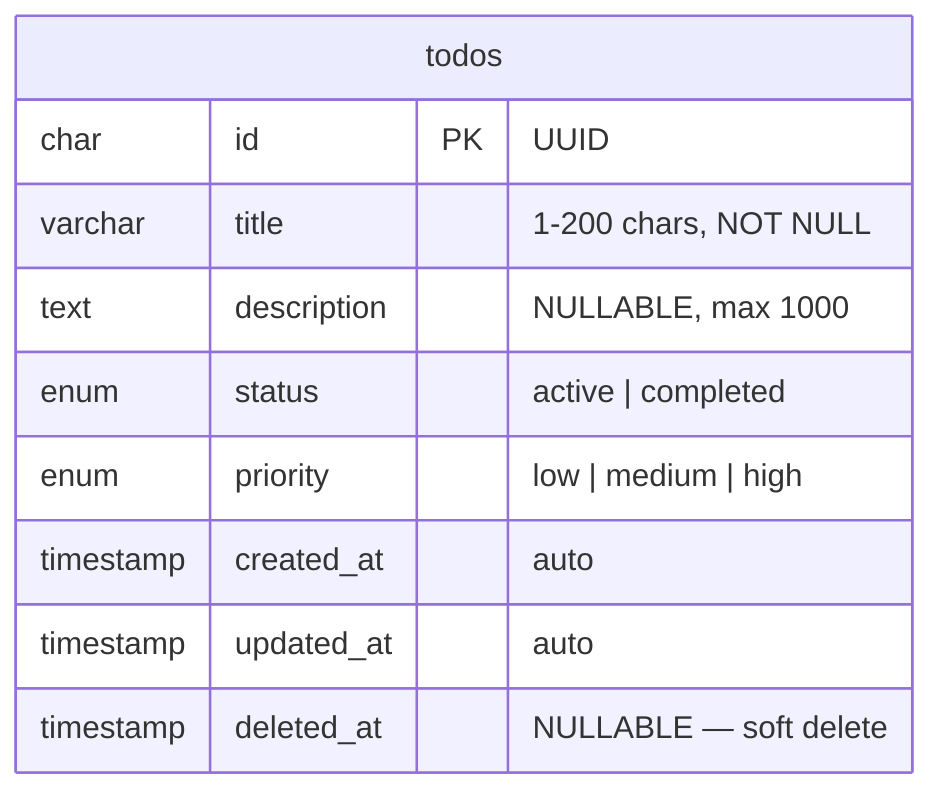

# Diagram ERD (Entity Relationship Diagram)

## Catatan

- `deleted_at` digunakan untuk soft delete — todo yang dihapus tetap ada di database
- `status` default: `active`
- `priority` default: `medium`
- `id` menggunakan UUID v4 untuk keamanan (tidak mudah ditebak)
