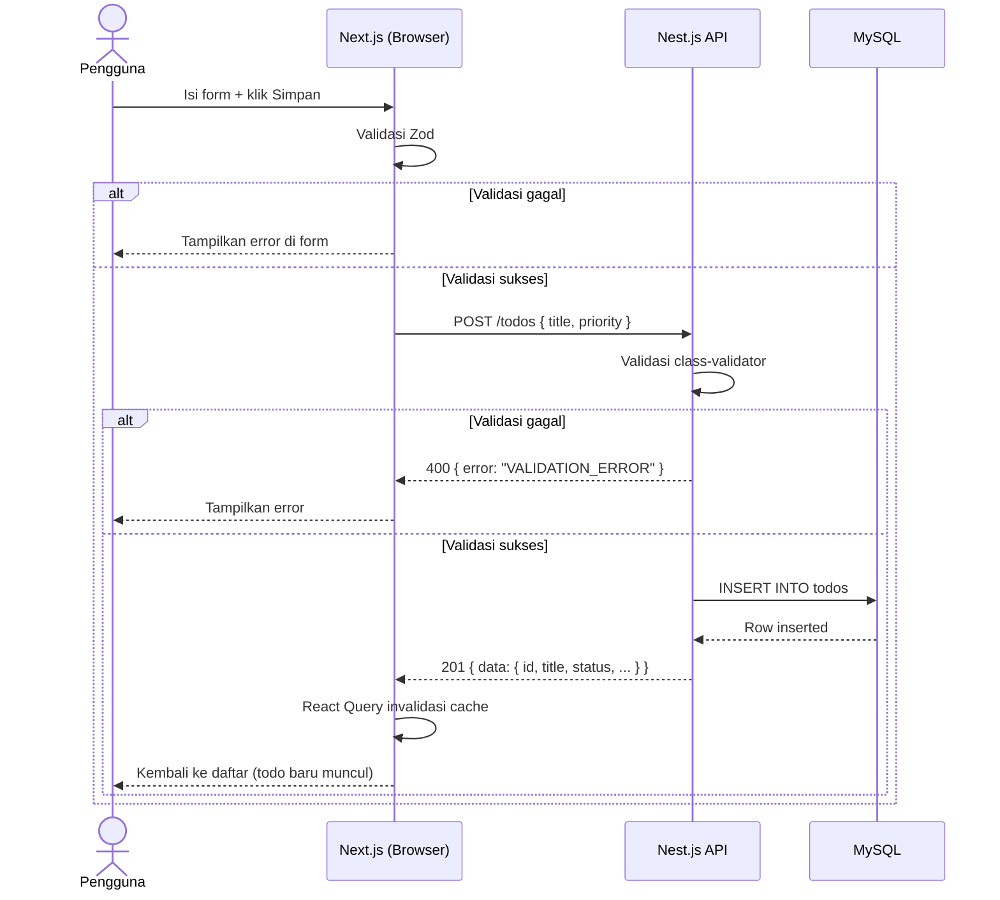

# Sequence Diagram: Create Todo

```mermaid
sequenceDiagram
    actor User as Pengguna
    participant Next as Next.js (Browser)
    participant API as Nest.js API
    participant DB as MySQL
    
    User->>Next: Isi form + klik Simpan
    Next->>Next: Validasi Zod
    alt Validasi gagal
        Next-->>User: Tampilkan error di form
    else Validasi sukses
        Next->>API: POST /todos { title, priority }
        API->>API: Validasi class-validator
        alt Validasi gagal
            API-->>Next: 400 { error: "VALIDATION_ERROR" }
            Next-->>User: Tampilkan error
        else Validasi sukses
            API->>DB: INSERT INTO todos
            DB-->>API: Row inserted
            API-->>Next: 201 { data: { id, title, status, ... } }
            Next->>Next: React Query invalidasi cache
            Next-->>User: Kembali ke daftar (todo baru muncul)
        end
    end
```
