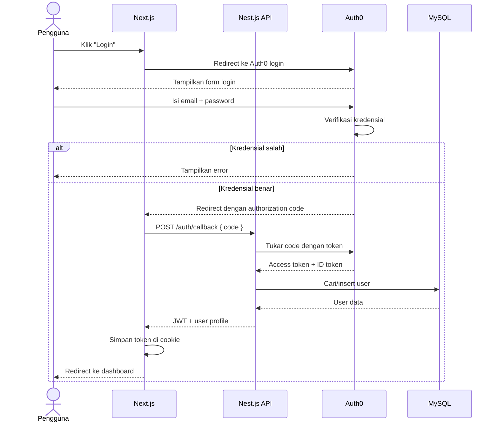

# Sequence Diagram: Login (v1)

```mermaid
sequenceDiagram
    actor User as Pengguna
    participant Next as Next.js
    participant API as Nest.js API
    participant Auth as Auth0
    participant DB as MySQL
    
    User->>Next: Klik "Login"
    Next->>Auth: Redirect ke Auth0 login
    Auth-->>User: Tampilkan form login
    User->>Auth: Isi email + password
    Auth->>Auth: Verifikasi kredensial
    alt Kredensial salah
        Auth-->>User: Tampilkan error
    else Kredensial benar
        Auth-->>Next: Redirect dengan authorization code
        Next->>API: POST /auth/callback { code }
        API->>Auth: Tukar code dengan token
        Auth-->>API: Access token + ID token
        API->>DB: Cari/insert user
        DB-->>API: User data
        API-->>Next: JWT + user profile
        Next->>Next: Simpan token di cookie
        Next-->>User: Redirect ke dashboard
    end
```
