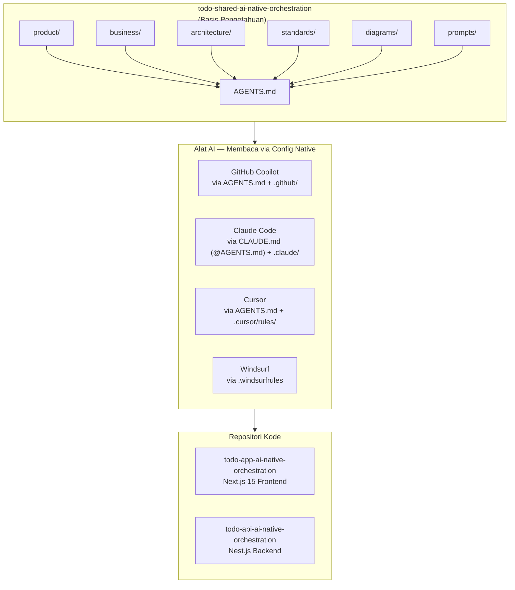

# Strategi Orkestrasi AI-Native

## Konsep

Proyek Todo menggunakan pendekatan **AI-Native Orchestration** — di mana dokumentasi domain (produk, bisnis, arsitektur, standar) disimpan dalam repositori terpisah (`todo-shared-ai-native-orchestration`) dan dikonsumsi oleh alat AI yang bekerja di repositori frontend dan backend.

## Arsitektur 3-Repo, 4-Tool

## Aliran Kerja AI

1. **AI membaca `AGENTS.md`** di repositori frontend/backend
2. **`AGENTS.md`** mengarahkan AI ke shared-context untuk pengetahuan domain
3. **AI menavigasi** ke dokumen yang relevan (`product/`, `business/`, `architecture/`, dll.)
4. **AI menghasilkan kode** yang sesuai dengan semua spesifikasi, aturan bisnis, dan standar

## Cara Setiap Alat Menggunakan

| Alat | File yang Dibaca | Keterangan |
|---|---|---|
| **GitHub Copilot** | `AGENTS.md` (native), `.github/instructions/*`, `.github/prompts/*` | Instruksi selalu aktif + file-scoped + slash commands |
| **Claude Code** | `CLAUDE.md` → `@AGENTS.md`, `.claude/rules/*`, `.claude/settings.json` | Impor universal base + aturan spesifik |
| **Cursor** | `AGENTS.md` (native), `.cursor/rules/*.mdc` | Universal base + aturan glob-scoped |
| **Windsurf** | `.windsurfrules` | Aturan level proyek |

## Menambahkan Prompt Baru

Untuk menambahkan template prompt baru:

1. Buat file `.md` di `prompts/` di shared-context
2. Buat file `.prompt.md` di `.github/prompts/` di repositori kode (untuk Copilot slash commands)
3. Update `AGENTS.md` jika prompt baru memerlukan dokumentasi tambahan

## Menambahkan Agent Baru

1. Buat file `.agent.md` di `.github/agents/` di repositori kode
2. Definisikan YAML frontmatter (description, tools, user-invocable)
3. Referensikan shared-context dalam instruksi agent

## Best Practices

- **Satu sumber kebenaran** — `api-contracts.md` adalah kontrak yang harus diikuti
- **Dokumentasi sebelum kode** — AI harus membaca konteks sebelum menghasilkan
- **Dokumen hidup** — perbarui saat keputusan berubah
- **Bahasa Indonesia** — untuk konten; istilah teknis tetap bahasa Inggris
